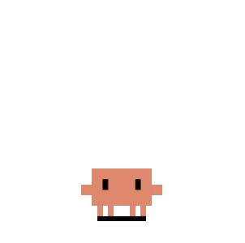
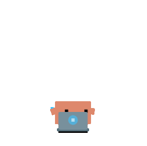
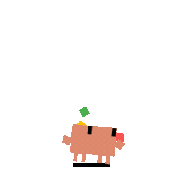
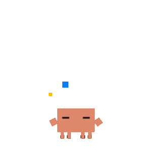
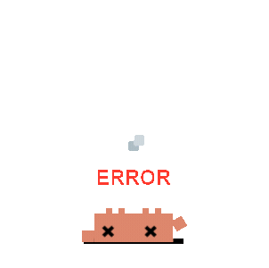
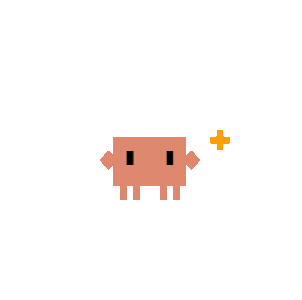
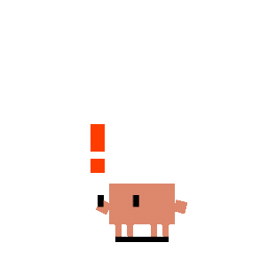

<p align="center">
  
</p>
<h1 align="center">Clyde 桌宠</h1>
<p align="center">
  轻量级 AI 编程桌宠，实时映射助手工作状态
  <br>
  <a href="README.md">English</a>
</p>
<p align="center">
  
  
  
  
  
</p>

Clyde 是一只住在桌面上的宠物，能实时感知 AI 编程助手在做什么：提问时思考，跑工具时打字，子代理工作时杂耍，弹卡片审批权限，任务完成时庆祝，你离开时睡觉。

支持 **Claude Code**、**Codex CLI** 和 **Copilot CLI**，三者可同时运行。

## 快速开始

```bash
git clone https://github.com/QingJ01/Clyde.git
cd Clyde
npm install
npm start        # Tauri 开发模式，前端热更新
```

**前置条件** — [Node.js](https://nodejs.org/) v18+、[Rust](https://rustup.rs/) stable、平台相关 [Tauri 依赖](https://v2.tauri.app/start/prerequisites/)。

**Agent 配置** — 全部零配置：
- **Claude Code** — 启动时自动注册 command hook + HTTP 权限 hook
- **Codex CLI** — 自动轮询 `~/.codex/sessions/` 日志
- **Copilot CLI** — 检测到 `~/.copilot` 时自动配置

## 功能

### 动画

12 种动画状态，由实时 Agent 事件驱动：

| Agent 事件 | Clyde 的反应 | 预览 |
|---|---|---|
| 空闲 | 眼球跟随鼠标，身体微倾 |  |
| 提交提示词 | 思考 |  |
| 工具执行中 | 打字 |  |
| 3+ 个会话活跃 | 建造 |  |
| 1 个子代理 | 杂耍 |  |
| 2+ 个子代理 | 指挥 |  |
| 工具执行失败 | 报错闪烁 |  |
| 任务完成 | 开心弹跳 |  |
| 通知 | 惊跳 |  |
| 上下文压缩 | 扫地 |  |
| 创建 Worktree | 搬箱子 |  |
| 60 秒无活动 | 打哈欠 → 打盹 → 倒下 → 睡觉 |  |

### 交互

- **拖拽** — 任何状态下都能拖动，Pointer Capture 防止快甩丢失
- **双击** 戳一下，**连点 4 下** 东张西望
- **右键菜单** — 会话列表、免打扰、极简模式、大小、语言
- **系统托盘** — 调大小 (S/M/L)、免打扰、极简模式、语言、自动启动、退出

### 极简模式

拖到左/右屏幕边缘（或右键"极简模式"），Clyde 藏到边缘只露半身，悬停时探头，收起状态下仍能显示迷你通知和庆祝动画。

### 权限审批气泡

Claude Code 请求工具权限时，Clyde 在宠物旁弹出浮动卡片 — 允许、拒绝或选择建议规则（如"始终允许 Read"）。多个请求从宠物位置向上堆叠。如果你先在终端回答了，气泡自动消失。

Clyde 还会实时跟踪 Claude 的**权限模式**。当模式切换时（如通过 `/permissions` 切换到"自动编辑"），宠物旁会弹出短暂通知：

| 模式 | 含义 |
|------|------|
| 正常审批 | 工具调用需要你的批准 |
| 自动编辑 | 编辑操作自动通过，其他工具仍可能需要审批 |
| 跳过审批 | 不会再弹出权限审批气泡 |
| 仅规划 | 不执行工具，只做规划 |

### 会话智能

- **多会话优先级** — 所有会话中最高优先级的状态胜出
- **子代理感知** — 1 个子代理杂耍，2 个以上指挥
- **终端聚焦** — 右键某个会话可直接跳转到对应终端
- **自动清理** — 10 分钟无更新删除会话，5 分钟无更新降级工作状态
- **免打扰** — 静默所有事件，右键或托盘切换

## 项目结构

```
src-tauri/src/           Rust 后端
├── lib.rs               应用入口 + Tauri 命令
├── state_machine.rs     多会话状态追踪 + 优先级
├── http_server.rs       Axum HTTP (POST /state, /permission)
├── hooks.rs             Hook 部署 + settings.json 注册
├── permission.rs        权限气泡窗口
├── mini.rs              边缘吸附、探头、抛物线跳跃
├── tick.rs              50ms 光标轮询（眼球、睡眠、探头）
├── tray.rs              系统托盘菜单
├── windows.rs           窗口边界 + 命中测试
├── focus.rs             按 PID 聚焦终端 (Win/Mac/Linux)
├── codex_monitor.rs     Codex JSONL 日志轮询
├── prefs.rs             偏好持久化
└── i18n.rs              中英文字符串

src/windows/             Svelte 5 前端（3 个窗口）
├── pet/                 SVG 渲染器
├── hit/                 不可见点击层
└── bubble/              权限审批卡片

hooks/                   JS hook 脚本（编译时嵌入）
├── clyde-hook.js        Claude Code 命令 hook
├── server-config.js     端口发现
├── auto-start.js        SessionStart 自动拉起
├── copilot-hook.js      Copilot CLI hook
└── install.js           手动 hook 注册 CLI

assets/svg/              35 个动画帧
```

## 技术栈

| 层 | 技术 | 为什么选它 |
|---|---|---|
| **桌面框架** | [Tauri v2](https://v2.tauri.app/) | 打包体积 ~5 MB（Electron 动辄 150 MB+）；原生系统 API（透明窗口、托盘、全局快捷键）；Rust 后端直接调用，零 IPC 序列化开销 |
| **后端语言** | [Rust](https://www.rust-lang.org/) | 无 GC、零成本抽象；50 ms 定时器 + 多会话状态机跑在单进程里，CPU 占用趋近于零；`Mutex` + `Arc` 天然线程安全 |
| **前端框架** | [Svelte 5](https://svelte.dev/) | 编译时生成极小运行时（无虚拟 DOM），三个窗口 JS 合计 < 30 KB；`$state` / `$props` 响应式模型让 SVG 渲染逻辑极简 |
| **HTTP 服务** | [Axum](https://github.com/tokio-rs/axum) | 构建在 Tokio 上的异步 Web 框架；类型安全路由 + 提取器；与 Tauri 共享同一 Tokio 运行时，无额外线程池 |
| **构建工具** | [Vite](https://vitejs.dev/) | 开发时毫秒级热更新；生产构建 Tree-shaking 极致精简 |

**组合优势：** Rust 处理所有状态逻辑和系统交互，Svelte 只做最薄的渲染层，Tauri 把两者粘合成一个 < 10 MB 的跨平台桌面应用。整个架构没有任何运行时解释器（Node.js、Python 等），冷启动 < 1 秒，常驻内存 < 30 MB。

## 已知限制

| 限制 | 说明 |
|---|---|
| Codex: 无终端聚焦 | JSONL 轮询不携带终端 PID |
| Copilot: 无权限气泡 | Copilot hook 协议仅支持拒绝 |
| HTTP 服务无认证 | 仅绑定 `127.0.0.1`；计划添加 token 认证 |
| 无自动更新 | 请从 GitHub Releases 下载新版本 |

## 故障排除

### macOS: 提示"应用已损坏，无法打开"

这是 macOS Gatekeeper 拦截未签名应用，并非真的损坏。修复方法：

```bash
xattr -cr "/Applications/Clyde on Desk.app"
codesign --force --deep --sign - "/Applications/Clyde on Desk.app"
```

第一条命令清除隔离标记，第二条添加本地临时签名（Apple Silicon 必需）。

### 权限气泡不弹出

如果 Claude Code 请求工具权限时 Clyde 没有弹出审批卡片：

1. 在 Claude Code 中运行 `/hooks`，检查 `PermissionRequest` 是否有 `[http]` hook
2. 如果缺失或格式错误，重启 Clyde — 启动时会自动重新注册 hooks
3. 如果仍有问题，手动运行 `node hooks/install.js`
4. 最后手段：删除 `~/.claude/settings.json` 中的 `PermissionRequest` 条目，重启 Clyde

`~/.claude/settings.json` 中正确的格式应为：

```json
"PermissionRequest": [
  {
    "matcher": "",
    "hooks": [
      { "type": "http", "url": "http://127.0.0.1:23333/permission", "timeout": 600 }
    ]
  }
]
```

> 权限气泡仅在 Claude Code 触发 `PermissionRequest` 事件的工具调用时出现。

## 贡献

欢迎 Issue、建议和 PR — [提交 Issue](https://github.com/QingJ01/Clyde/issues) 或直接提 PR。

```bash
npm test             # cargo test（19 个单元测试）
```

### 贡献者

<table>
  <tr>
    <td align="center"><a href="https://github.com/QingJ01"><br /><sub><b>QingJ01</b></sub></a><br /><sub>核心贡献者</sub></td>
    <td align="center"><a href="https://github.com/rullerzhou-afk"><br /><sub><b>rullerzhou-afk</b></sub></a><br /><sub>原项目作者</sub></td>
    <td align="center"><a href="https://github.com/PixelCookie-zyf"><br /><sub><b>PixelCookie-zyf</b></sub></a><br /><sub>项目初始贡献者</sub></td>
    <td align="center"><a href="https://github.com/yujiachen-y"><br /><sub><b>yujiachen-y</b></sub></a><br /><sub>项目初始贡献者</sub></td>
    <td align="center"><a href="https://github.com/AooooooZzzz"><br /><sub><b>AooooooZzzz</b></sub></a><br /><sub>项目初始贡献者</sub></td>
    <td align="center"><a href="https://github.com/purefkh"><br /><sub><b>purefkh</b></sub></a><br /><sub>项目初始贡献者</sub></td>
  </tr>
  <tr>
    <td align="center"><a href="https://github.com/Tobeabellwether"><br /><sub><b>Tobeabellwether</b></sub></a><br /><sub>项目初始贡献者</sub></td>
    <td align="center"><a href="https://github.com/Jasonhonghh"><br /><sub><b>Jasonhonghh</b></sub></a><br /><sub>项目初始贡献者</sub></td>
    <td align="center"><a href="https://github.com/crashchen"><br /><sub><b>crashchen</b></sub></a><br /><sub>项目初始贡献者</sub></td>
    <td align="center"><a href="https://github.com/hongbigtou"><br /><sub><b>hongbigtou</b></sub></a><br /><sub>项目初始贡献者</sub></td>
    <td align="center"><a href="https://github.com/InTimmyDate"><br /><sub><b>InTimmyDate</b></sub></a><br /><sub>项目初始贡献者</sub></td>
    <td align="center"><a href="https://github.com/NeizhiTouhu"><br /><sub><b>NeizhiTouhu</b></sub></a><br /><sub>项目初始贡献者</sub></td>
  </tr>
</table>


## 致谢

- 由 [Clawd on Desk](https://github.com/rullerzhou-afk/clawd-on-desk) ([@rullerzhou-afk](https://github.com/rullerzhou-afk)) 演化而来 — 最初的 Clawd 桌宠项目
- Clyde 像素风格参考自 [clawd-tank](https://github.com/marciogranzotto/clawd-tank) by [@marciogranzotto](https://github.com/marciogranzotto)
- 感谢 [LINUX DO](https://linux.do/) 社区的反馈与支持
- Clyde 角色（"ClawdWizard"）为社区创作。本项目非 [Anthropic](https://www.anthropic.com) 官方产品。

## 许可证

[AGPL-3.0](LICENSE)
